A 2D Real Time Strategy Game inspired from OpenRA built on java.

User Diagram:
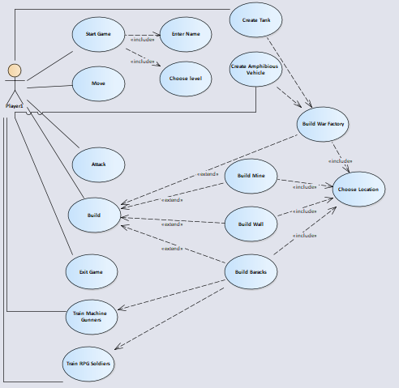

User Stories:

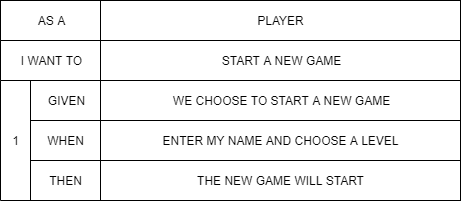

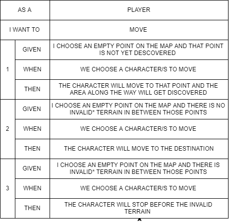

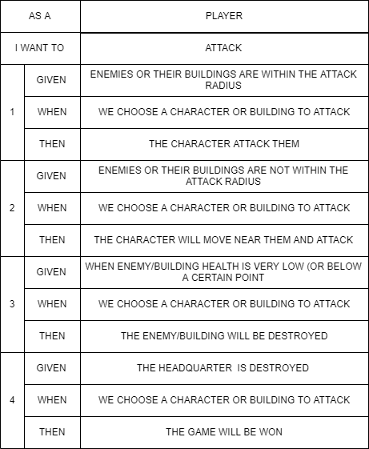

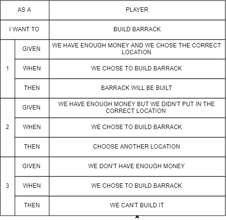

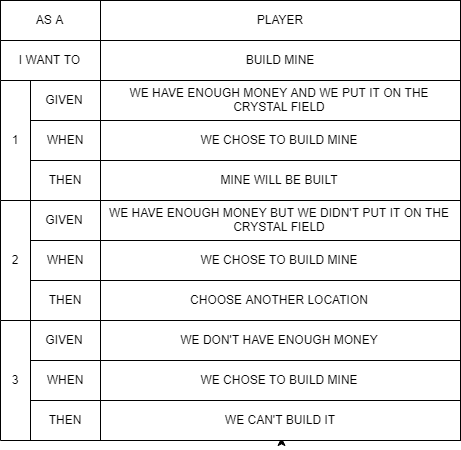

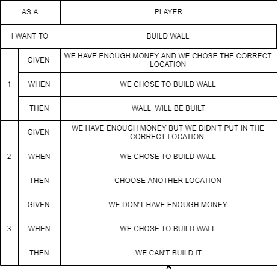

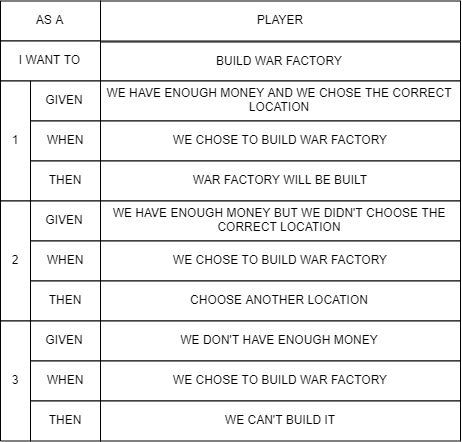

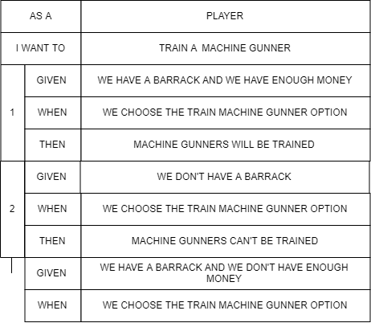

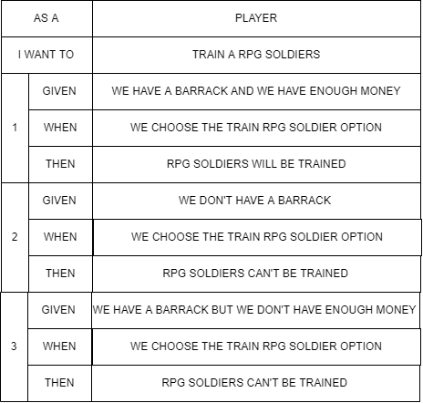

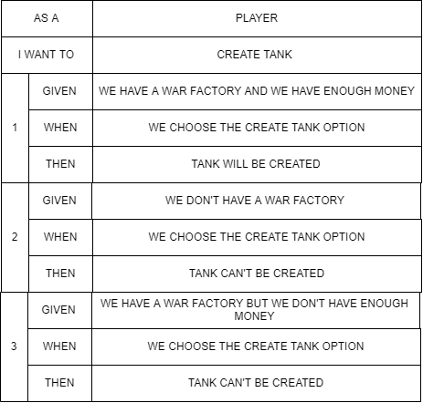

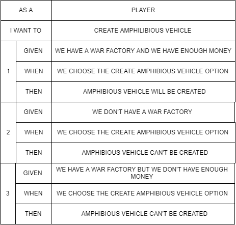

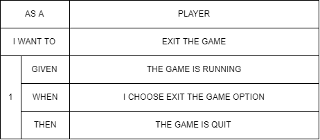

Description about user stories:

Use Cases:

Start Game: User selects menu item 1 to start the game, and it asks user to enter name.

Move: The user can move soldiers and vehicles. User first selects them and then right click on the location where user wants them to move. 

Attack: The user can attack his enemies and their buildings, when enemies or their buildings are close on specified distance.

Build: The user can build 4 types of buildings, those are: Mine, War factory, Barack, Wall. for all kinds of buildings user must have enough money and has chosen correct location (eg: not in Water, not on Mountain) to build.

War Factory: after building war factory, user can create Tank, and Amphibious vehicle if user has enough money.

Mine:  the user can only build mines on crystals, and after building mine user can earn money after every specified time.

Barack: after building barack, user can train Machine Gunners and RPG soldiers if user has enough money he can train as many as he wants.

Wall: user can build wall to defend his territory from enemies.

Tank: Tank can attack enemy troops and buildings.

Amphibious Vehicle: Amphibious Vehicle can also attack but it has less damage than tanks and it moves fast than tanks too.

Machine Gunners: Machine gunners attack enemy troops and buildings.

RPG Soldiers: RPG Soldiers also attack  enemy troops and buildings but they have more damage than machine gunners.

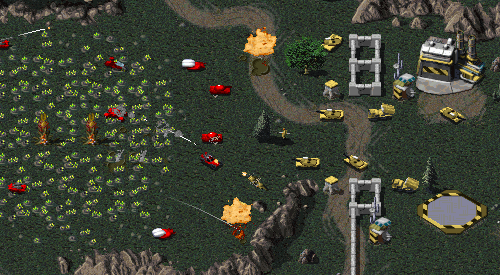

